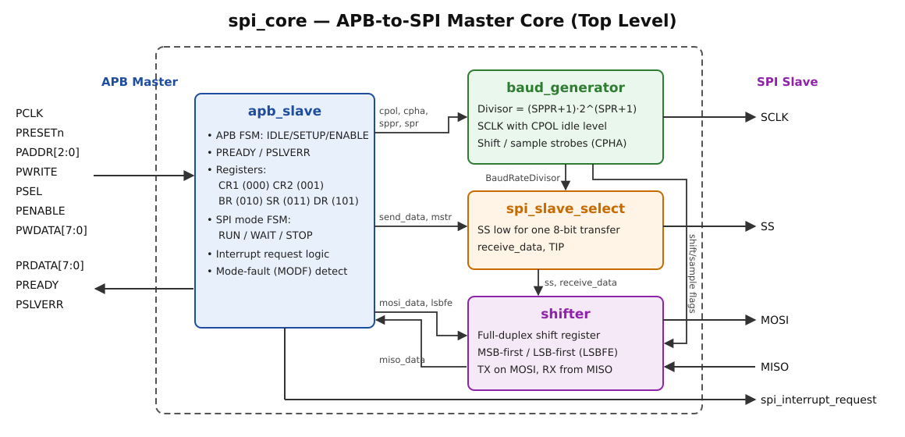
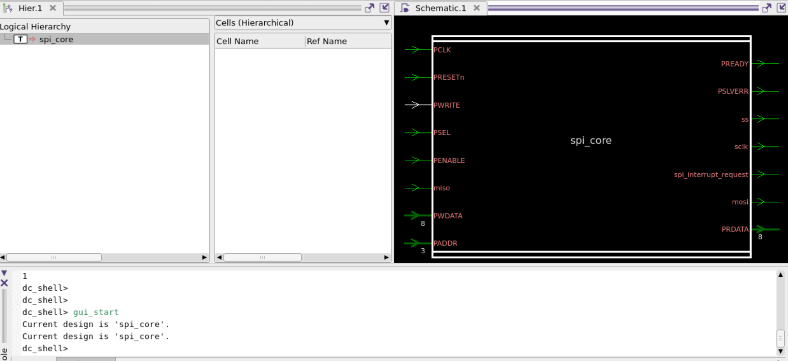
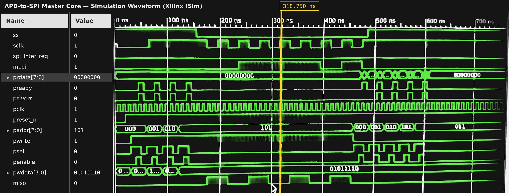

# APB Interface with Master SPI Core — RTL Design

An **AMBA APB-to-SPI master bridge** designed in **Verilog**. A processor on the APB bus programs the core through memory-mapped registers. The core then runs full-duplex SPI transfers to an external slave: it generates SCLK and slave select (SS), shifts data out on MOSI, and captures data from MISO.

**Highlights:** FSM-based APB slave · programmable baud-rate generator · all 4 SPI modes (CPOL/CPHA) · MSB-first / LSB-first · RUN/WAIT/STOP low-power modes · interrupt and mode-fault support · lint-clean RTL

---

## Tools & Technologies

| Category | Used |
|---|---|
| **HDL** | Verilog (Verilog-2001) |
| **Simulation** | Synopsys VCS, Xilinx ISE Simulator (ISim) |
| **Waveform debug** | Synopsys Verdi, Xilinx ISim |
| **Lint** | Synopsys VC SpyGlass (VC Static X-2025.06) — 0 errors, 0 latches · Verilator `-Wall` |
| **Synthesis** | Synopsys Design Compiler X-2025.06 (`lsi_10k`) — timing met at 50 MHz, 0 latches |
| **Protocols** | AMBA APB, SPI (Serial Peripheral Interface) |
| **Platform** | Linux |

---

## Block Diagram

<p align="center"></p>

| Module | File | Function |
|---|---|---|
| `spi_core` | [`rtl/spi_core.v`](rtl/spi_core.v) | Top level. Connects the four sub-modules. |
| `apb_slave` | [`rtl/apb_slave.v`](rtl/apb_slave.v) | APB FSM, register block, SPI mode FSM, interrupt and mode-fault logic. |
| `baud_generator` | [`rtl/baud_generator.v`](rtl/baud_generator.v) | Divides PCLK to make SCLK. Creates the shift and sample strobes for each SPI mode. |
| `spi_slave_select` | [`rtl/spi_slave_select.v`](rtl/spi_slave_select.v) | Drives SS low for one 8-bit transfer. Generates `receive_data` and `tip`. |
| `shifter` | [`rtl/shifter.v`](rtl/shifter.v) | Full-duplex shift register for MOSI (transmit) and MISO (receive). |
| — | [`rtl/apb_spi_defines.vh`](rtl/apb_spi_defines.vh) | Shared width definitions: 8-bit data, 3-bit address. |

---

## Design Details

### 1. APB slave interface
- A 3-state FSM, **IDLE → SETUP → ENABLE**, follows the APB protocol. `PSEL` without `PENABLE` moves to SETUP, and `PSEL` with `PENABLE` moves to ENABLE.
- `PREADY` is asserted in the ENABLE (access) phase.
- `PSLVERR` is asserted when an access happens during an SPI transfer in progress (`tip`).
- Writes and reads take place in the ENABLE phase. Every register address is fully decoded.

### 2. Register map

| PADDR | Register | Access | Reset | Bits |
|---|---|---|---|---|
| `3'b000` | **SPI_CR_1** | R/W | `0x04` | `[7]` SPIE · `[6]` SPE · `[5]` SPTIE · `[4]` MSTR · `[3]` CPOL · `[2]` CPHA · `[1]` SSOE · `[0]` LSBFE |
| `3'b001` | **SPI_CR_2** | R/W (mask `0x1B`) | `0x00` | `[4]` MODFEN · `[1]` SPISWAI |
| `3'b010` | **SPI_BR** | R/W (mask `0x77`) | `0x00` | `[6:4]` SPPR · `[2:0]` SPR |
| `3'b011` | **SPI_SR** | R | `0x20` | `[7]` SPIF · `[5]` SPTEF · `[4]` MODF |
| `3'b101` | **SPI_DR** | R/W | `0x00` | Transmit / receive data |

### 3. Baud-rate generator

The SCLK frequency is set by the BR register:

```
BaudRateDivisor = (SPPR + 1) × 2^(SPR + 1)
SCLK toggles every BaudRateDivisor PCLK cycles, so f_SCLK = f_PCLK / (2 × BaudRateDivisor)
```

- When the bus is idle, SCLK rests at the **CPOL** level.
- SCLK runs only while SS is low.
- The block also creates the **shift** and **sample** strobes. They put MOSI changes and MISO sampling on the correct SCLK edge for each mode.

| Mode | CPOL | CPHA | SCLK idle | Data sampled on |
|---|---|---|---|---|
| 0 | 0 | 0 | Low | Rising edge |
| 1 | 0 | 1 | Low | Falling edge |
| 2 | 1 | 0 | High | Falling edge |
| 3 | 1 | 1 | High | Rising edge |

### 4. Slave select and transfer timing
- Writing data starts a transfer. **SS goes low** for 16 × BaudRateDivisor PCLK cycles, which is 8 SCLK periods, one per data bit.
- At the end of the transfer, `receive_data` is pulsed so the received byte is loaded into SPI_DR.
- `tip` (transfer in progress) = `~SS`.

### 5. Shift-register datapath
- Transmit data from SPI_DR is loaded into the shift register and sent out on **MOSI**.
- Receive data from **MISO** is collected into a separate register.
- **LSBFE = 1** sends least-significant bit first. **LSBFE = 0** sends most-significant bit first.

### 6. SPI operating modes and interrupts
- **Mode FSM:** **RUN** while SPE = 1. **WAIT** when SPE = 0. **STOP** when SPE = 0 and SPISWAI = 1, which also stops SCLK generation.
- **Status flags:** **SPIF** means data received. **SPTEF** means the transmit register is empty. **MODF** is a mode fault, raised when SS is driven low while in master mode with MODFEN = 1 and SSOE = 0.
- **`spi_interrupt_request`** combines these flags. SPIE enables SPIF/MODF, and SPTIE enables SPTEF.

---

## Lint & Synthesis

The RTL is written to be **lint-clean and synthesis-ready**:
- **No latches.** The status register is pure combinational logic.
- **Every flip-flop has a constant asynchronous reset.**
- **No dead or always-true comparisons.**
- **Explicit bit widths** throughout.

### Lint — Synopsys VC SpyGlass (`lint_rtl`)

| Fatal | Error | Warning | Info | Latches | Flip-flops |
|---|---|---|---|---|---|
| **0** | **0** | 1 (tool setup) | 11 | **0** | 110 |

The one warning comes from the empty link-library setting, not from the RTL. The infos note unregistered top-level ports, which is expected for an APB slave. Full report, run log and explanation: [`lint/`](lint/).

Additional open-source checks: Verilator 5 `--lint-only -Wall` gives **0 warnings**, and slang `-Weverything` gives **0 warnings**.

### Synthesis — Synopsys Design Compiler (`compile_ultra`, `lsi_10k`)

| Clock | Setup slack | Total cell area | Cells | Flip-flops | Latches |
|---|---|---|---|---|---|
| 20 ns (50 MHz) | **+0.02 ns (MET)** | **2105** | 811 | 104 | **0** |

The critical path runs from the baud-rate register through the divisor arithmetic to the baud counter. Six register bits that the write masks hold at 0 were removed as constants. Reports, run log and schematics: [`syn/`](syn/).

<p align="center"></p>

---

## Simulation Waveform

<p align="center"></p>

The waveform shows one complete operation:

1. **Reset:** `preset_n` is held low, then released.
2. **Register programming over APB:** with `pwrite = 1`, the testbench writes `paddr` 000 → 001 → 010 → 101 (CR1, CR2, BR, DR). Each access shows the APB **SETUP** phase (`psel`) followed by the **ENABLE** phase (`psel` + `penable`) with `pready`. The data byte written to SPI_DR is `pwdata = 01011110`.
3. **SPI transfer:** `ss` goes low, `sclk` toggles at the programmed baud rate, the byte is shifted out on `mosi`, and `miso` is sampled.
4. **End of transfer and read-back:** `ss` returns high. With `pwrite = 0`, the registers are read back over APB, and `prdata` shows each register's value.

---

## Repository Structure

```
APB-SPI-Master-RTL-Design/
├── rtl/
│   ├── apb_spi_defines.vh    # width definitions
│   ├── spi_core.v            # top level
│   ├── apb_slave.v           # APB FSM, registers, mode FSM, interrupt
│   ├── baud_generator.v      # SCLK + shift/sample strobes
│   ├── spi_slave_select.v    # SS and transfer timing
│   └── shifter.v             # MOSI/MISO shift registers
├── sim/
│   └── filelist.f            # RTL compile list
├── lint/
│   ├── vc_lint.tcl           # VC SpyGlass lint script
│   ├── Makefile
│   ├── README.md             # lint results explained
│   └── reports/              # report_lint.txt, run log
├── syn/
│   ├── dc_synth.tcl          # Design Compiler synthesis script
│   ├── README.md             # synthesis results explained
│   ├── reports/              # timing, area, power reports + run log
│   └── images/               # schematics (Design Vision)
└── docs/
    ├── block_diagram.svg
    └── waveform_apb_spi_rtl.png
```

## How to Run

Compile the RTL with your testbench. From the `sim/` folder:

```bash
# Synopsys VCS (with debug access for Verdi)
vcs -full64 -sverilog -debug_access+all -f filelist.f <your_testbench>.v -top <tb_top>
./simv
verdi -f filelist.f <your_testbench>.v &

# Synopsys VC SpyGlass lint (from lint/)
make lint

# Synopsys Design Compiler synthesis (from syn/, set TARGET_LIB first)
dc_shell -f dc_synth.tcl | tee dc_synth.log

# Open-source lint check
verilator --lint-only -Wall -I../rtl --top-module spi_core ../rtl/*.v
```

---

## Author

**Dhanush** — RTL Design & Verification Engineer
[LinkedIn](https://www.linkedin.com/in/dhanush-71b36841b) · [GitHub](https://github.com/Dhanush30-DV)

*Project completed during Advanced VLSI Design & Verification training at Maven Silicon, Bangalore.*
