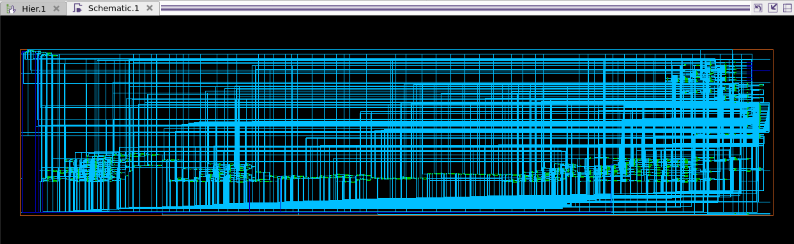

# Synthesis — Synopsys Design Compiler

**Tool:** Synopsys Design Compiler X-2025.06 (`compile_ultra`)
**Library:** `lsi_10k`
**Top:** `spi_core`
**Constraint:** 20 ns PCLK (50 MHz)

## Results

| Metric | Value |
|---|---|
| **Timing (setup)** | **MET**, worst slack **+0.02 ns** |
| **Total cell area** | **2105** (combinational 1193 · sequential 912) |
| Cells | 811 (707 combinational · 104 sequential) |
| Buffers / inverters | 90 |
| **Latches** | **0** |
| Unresolved references / black boxes | **0** |
| Dynamic power | 759 nW (switching only — see note) |

### What the run shows
- All four blocks were read and linked with no linking messages: `apb_slave`, `baud_generator`, `spi_slave_select` and `shifter`.
- Every inferred storage element is an **edge-triggered flip-flop with asynchronous reset**. No latches were inferred.
- **6 constant registers were removed**: `SPI_CR_2[7,6,5,2]` and `SPI_BR[7,3]`. The write masks (`cr2_mask = 8'h1B`, `br_mask = 8'h77`) keep these bits at 0 forever, so DC removes them. This is why there are 110 flip-flops after elaboration and 104 after compile.
- `compile_ultra` ungrouped the four sub-blocks, so the final netlist is flat.

### Critical path
The critical path runs from `APB_INTERFACE/SPI_BR_reg[0]` to `BAUD_GEN/count_reg[1]`. A change in the baud-rate register (SPPR/SPR) goes through the divisor calculation `(SPPR+1) × 2^(SPR+1)`, then the 12-bit compare with the counter, and ends at the counter register. Data arrives at 19.13 ns against a required time of 19.15 ns.

> **Note on power:** `lsi_10k` is a teaching library without internal or leakage power characterization (DC messages `PWR-424` / `PWR-799`). Only net switching power is reported.

## Schematics

**Top level (`spi_core`):**

**Gate-level netlist (flattened after `compile_ultra`):**

## Files

| File | Description |
|---|---|
| [`dc_synth.tcl`](dc_synth.tcl) | Synthesis script: library setup, constraints, `compile_ultra`, reports, netlist |
| [`reports/spi_timing.rpt`](reports/spi_timing.rpt) | Worst setup path |
| [`reports/spi_area.rpt`](reports/spi_area.rpt) | Area and cell counts |
| [`reports/spi_power.rpt`](reports/spi_power.rpt) | Power report |
| [`reports/dc_synth.log`](reports/dc_synth.log) | Complete Design Compiler run log |
| [`images/`](images/) | Schematic screenshots from Design Vision |

For the run, the RTL modules from [`../rtl`](../rtl) were combined into a single file, `apb_spi_core_all.v`, with identical code. The line numbers in the log refer to that combined file.
